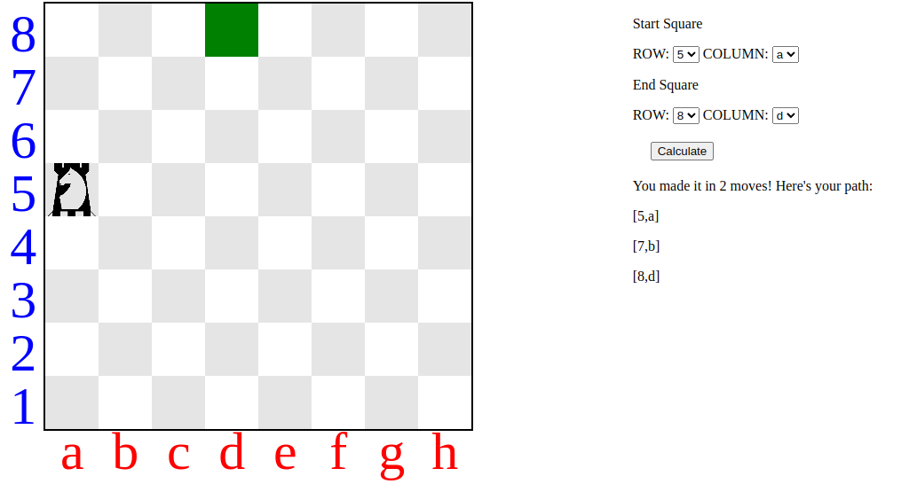
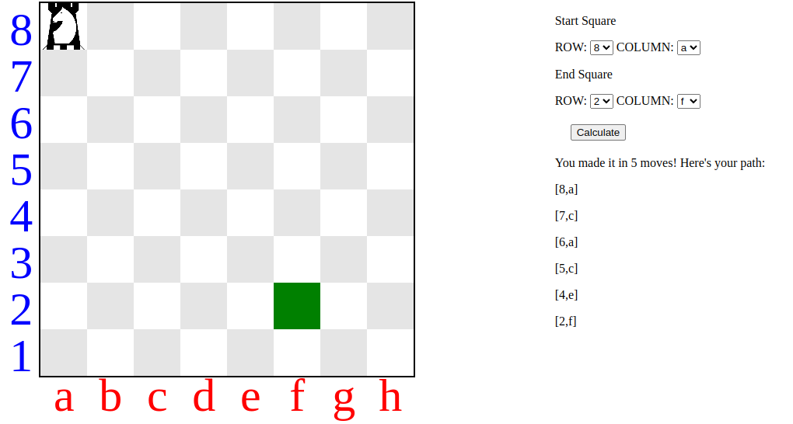

# 16.odin_knights_travails

[Task Description](https://www.theodinproject.com/lessons/javascript-knights-travails)

[Live Preview](https://maxim55069633.github.io/16.odin_knights_travails/)

In this lesson, I use recursion to find the shortest path for a knight between two chess squares.

I learn:

1. Use parseInt to convert a string to an integer otherwise the data from form can't be used.
2. forEach can't be stopped like ordinary for loop. Return within the forEach cannot jump out of it as well.

sample:

1. 

2. 

I use the following image from bing under the license: free to share and use commercially
[Chess knight](https://cn.bing.com/images/search?view=detailV2&ccid=wfNEgHwO&id=973A10C3ECDC25735900938D296366B2A02051B5&thid=OIP.wfNEgHwOYcrV-G9tFzYV7gAAAA&mediaurl=https%3a%2f%2fnewzealandchess.nz%2f2018%2fImages%2fACCLogo.png&exph=299&expw=250&q=knight+chess&simid=608033143185427554&FORM=IRPRST&ck=C2AEB65173B1EC675551A2629F86AD25&selectedIndex=19&qft=+filterui%3aphoto-transparent+filterui%3alicense-L2_L3_L4_L5_L6_L7&ajaxhist=0&ajaxserp=0)
